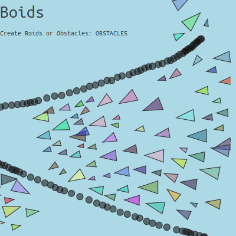

# Boids
A Boid-simulator

My version of [Coding Challenge #124](https://www.youtube.com/watch?v=mhjuuHl6qHM)

**[See it here!](https://lenaindelaforetmagique.github.io/Boids/)**

## Screenshot!

## Controls
### Mouse
  - click to create Boids or Obstacles;
  - click on selector to toggle Boids or Obstacles creator;
  - wheel to zoom in/out

### Touch
  - same as Mouse
  - use several fingers to zoom in/out or translate

### Keyboard
  - press CTRL to activate Obstacles creator

License
=======

_Boids_ is licensed under the [MIT License](LICENSE). Distribute and modify at will!

Ubuntu Mono font from [Google Fonts](https://fonts.google.com/specimen/Ubuntu+Mono), distributed under the [SIL Open Font License, 1.1](http://scripts.sil.org/cms/scripts/page.php?site_id=nrsi&id=OFL).
